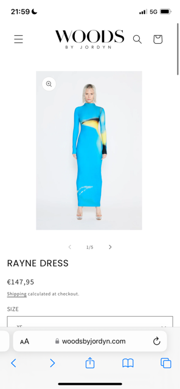
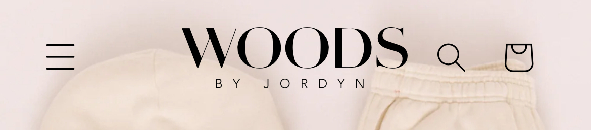

# Procesverslag
Markdown is een simpele manier om HTML te schrijven.  

## Jij

  
uitwerken voor kick-off werkgroep

  ### Auteur:
 Naomi-Ashley Felter

  #### Je startniveau:
  Min blauw: Hoewel ik nog niet heel ervaren ben met het schrijven van code, was ik enthousiast om hiermee aan de slag te gaan.

  #### Je focus:
  Surface plane: Mijn doel is om een nette, functionele webpagina te maken die er strak uitziet en ook makkelijk is aan te passen.
 

## Je website

  
uitwerken voor kick-off werkgroep

  ### Je opdracht:
  www.WOODSBYJORDYN.com | Online kledingwinkel 

  #### Screenshot(s) van de eerste pagina (small screen): 
  Home pagina
  

  #### Screenshot(s) van de tweede pagina (small screen):
  Product pagina  
  
 

## Toegankelijkheidstest 1/2 (week 1)

  
uitwerken na test in 2e werkgroep

  ### Bevindingen
  Lijst met je bevindingen die in de test naar voren kwamen:

  - gebruiken div dus er is geen spraken van h1- structuur
  - skipt headings
  - gebruiken elementen zoals (ol, ul of dl)
  - keyboard werkt goed 
  - goede focus state

## Breakdownschets (week 1)

  
uitwerken na afloop 3e werkgroep

  ### de hele pagina: 
  
  

  ### dynamisch deel (bijv menu): 
  

  ### wellicht nog een dynamisch deel (bijv filter): 
  

## Voortgang 1 (week 2)

  
uitwerken voor 1e voortgang

  ### Stand van zaken
 Ik werkte nog met mijn code van vorig jaar en ervaarde verwarring. Dit kwam doordat ik mijn code niet vloeiend kon lezen en niet meer wist waarom ik bepaalde keuzes had gemaakt.

  Tijdens het gesprek werd mij geadviseerd om een nieuwe breakdown te maken en niet meer terug te kijken naar mijn oude breakdown.

  Daarnaast zijn de volgende punten besproken:

  - Er was een verkeerde link gekoppeld aan mijn GitHub; dit moet ik corrigeren.
  - Het advies is om me te richten op de nieuwe breakdown, zodat er een duidelijke HTML-structuur wordt toegepast.
  - Het wordt aangeraden om meer te denken als een programmeur
 

  ### Verslag van meeting
  hier na afloop snel de uitkomsten van de meeting vastleggen

  - Ik heb de breakdown schetsen gedaan en het gaf meer structuur. Hierdoor heb ik de keuze genomen om opnieuw te beginnnen niet dat mijn HTML structuur verkeerd was maar dat ik begreep wat ik aan het doen was. 

  - Verder ben ik de oefening gaan maken zodat ik het beter begrijp waar het over gaat en wat er precies verwacht wordt. Het maken van de oefening gaf mij meer zekerheid in wat ik aan het doen ben en waarom ik het aan het doen ben. Ik had moeite om grid te begrijpen en na het maken van de oefening ben ik veel wijzer. 

## Voortgang 2 (week 3)

  
uitwerken voor 2e voortgang

  ### Stand van zaken
  ik heb mijn HTML structuur opgesteld maar nog niet helemaal mijn CSS structuur en daarmee loop ik achter met FED. Ik was te veel gefocust om 1 onderdeel die ik wilde laten werken voordat ik  verder ging omdat ik gewoon nieuwsgierig ben waarom het niet lukt XD.

  - Focus je niet te veel op de styl in je CSS ga verder met alleen de positionering en het toepassen van de kleur 
  - Je kan wel op 1 ding focussen en als het niet werk gewoon verder gaan

  ### Verslag van meeting
  hier na afloop snel de uitkomsten van de meeting vastleggen

  - ik ben aan de slag gegaan en niet te lang op 1 ding gebeleven
  - ik heb een vragenlijst voor mezelf gemaakt daaruit ben ik gekomen dat ik de basis dingen ben verleerd  

## Toegankelijkheidstest 2/2 (week 4)

  
uitwerken na test in 9e werkgroep

  ### Bevindingen
  Lijst met je bevindingen die in de test naar voren kwamen (geef ook aan wat er verbeterd is):

  - Geen discription bij de afbeeldingen
  - Video bevat geen audio heeft wel discription
  - Geen light dark mode
  - Helemaal geen animatie
  - Contrast overlag video en afbeelding niet

## Voortgang 3 (week 4)

  
uitwerken voor 3e voortgang

  ### Stand van zaken
  hier dit ging goed & dit was lastig (neem ook screenshots op van delen van je website en code)

  ### Verslag van meeting
  hier na afloop snel de uitkomsten van de meeting vastleggen

  - Ik had focus op shop pagina en dit is verwisselt naar product pagina 
  - Ik wilde kijken of ik het eerst zelf kan voordat ik de hulp vraag wat nodig is 
  - Geadviseerd om de lessen terug te kijken voor de micro interacties zoals, "like button"

## Eindgesprek (week 5)

  
uitwerken voor eindgesprek

  ### Je uitkomst - karakteristiek screenshots:
  

  ### Dit ging goed/Heb ik geleerd: 
  ik had geen dubbel foto hiervan dus moest ik creatief zijn en op Adobe Photoshop de resolutie verandert zodat het lijkt of ik twee verschillende jurken heb. 

  

  

  ### Dit was lastig/Is niet gelukt:
 Mijn slideshow, ik heb er echt mee gevochten maar helaas in de boxingring was ik niet de winnaar en zijn we tot gelijkstrand gekomen. Ook al lijkt het niet helemaal op dei van de website is het wel gelukt tot een zeker hoogte. De illusie is er.

  

  ### Je uitkomst - karakteristiek screenshots:
  

  ### Dit ging goed/Heb ik geleerd: 
  Ik had moeite met de dark mode omdat @media (preference etc.) had gebruikt en dat werkt niet lekker op me code ik weet niet waarom but I guess. Ik ben de slide gaan volgen en niu is die wel gelukt het was nog even puzzelen.

  Hierbij heb ik geleerd om het alleen in CSS aan te roepen en dat het echt voldoende is dus hierbij kwam het besef dat jewel veel kan met CSS.

  Hieronder zie je hoe ik het eerst had in mijn side en dat ik eenn kleine Java script had 

  

  ### Dit was lastig/Is niet gelukt:
Hierbij heb ik de dark mode aan en is het gelukt met alleen CSS

  

Hoewel ik nog niet alles volledig begrijp, ben ik tevreden met het resultaat. Ik heb echt mijn best gedaan om de code netjes en herbruikbaar te maken. Dit project heeft me laten zien dat CSS niet alleen draait om het visueel aantrekkelijk maken, maar ook om logisch nadenken en organiseren. En dat is eigenlijk best leuk!”

## Bronnenlijst

  
continu bijhouden terwijl je werkt

  Nb. Wees specifiek ('css-tricks' als bron is bijv. niet specifiek genoeg). 
  Nb. ChatGpT en andere AI horen er ook bij.
  Nb. Vermeld de bronnen ook in je code.

  1. https://developer.mozilla.org/en-US/docs/Web/HTML/Element/details
  2. https://stuffandnonsense.co.uk/blog/redesigning-your-product-and-website-for-dark-mode
  3. https://dlo.mijnhva.nl/content/enforced/609316-FDMCI-2000FED121-DMCI-CMD-2425-1/FED%2024-25%20-%20Blok%202%20-%20Intro%20images,%20icons%20en%20co.pdf
  4. https://codepen.io/shooft/pen/YzoaMbb?editors=0110
  5. https://www.youtube.com/watch?v=HZHHBwzmJLk
  6. https://www.youtube.com/watch?v=PHO6TBq_auI
  7.  https://www.blackbox.ai

